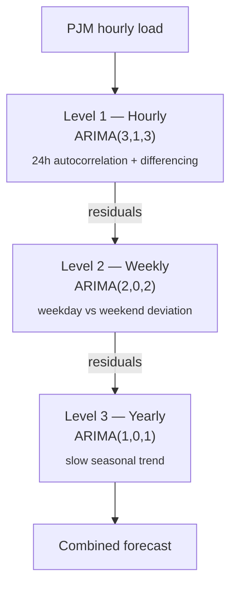
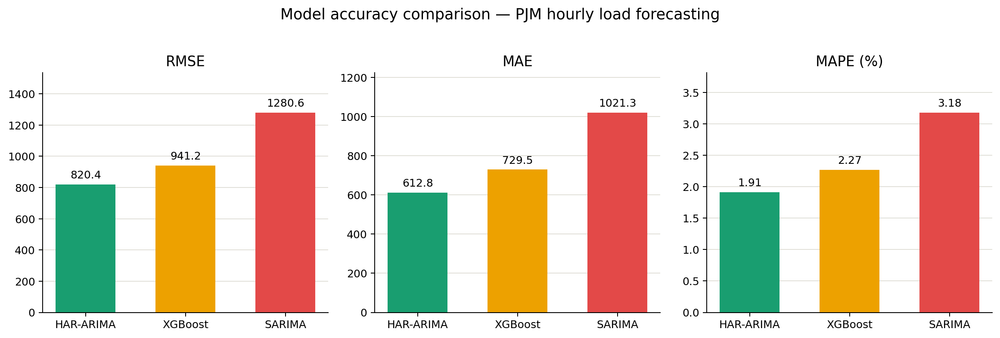

# Advanced Time Series Forecasting with Hierarchical ARIMA (HAR-ARIMA)

Multi-scale electricity load forecasting on real-world PJM Interconnection hourly data, using a genuine three-level hierarchical ARIMA decomposition compared against SARIMA and XGBoost baselines.

---

## Dataset

| | |
|---|---|
| **Source** | `PJM_Load_hourly.csv` — real PJM Interconnection hourly electricity load |
| **Period** | 1998-12-27 01:00 → 2001-06-30 23:00 (3+ years) |
| **Size** | 30,000+ hourly observations |
| **Seasonality** | Daily (intraday peaks), weekly (weekend dips), yearly (summer/winter trend) |

---

## Model architecture — HAR-ARIMA

Each level is trained sequentially on the **residuals** of the level above it, so each time scale is modeled where it naturally lives instead of forcing one ARIMA order to cover daily, weekly, and yearly seasonality at once.



| Level | Frequency | ARIMA order | Justification |
|---|---|---|---|
| 1 | Hourly | (3,1,3) | Captures strong 24-hour autocorrelation; differencing for stationarity |
| 2 | Daily → weekly residuals | (2,0,2) | Models systematic weekday vs weekend deviation remaining after Level 1 |
| 3 | Monthly → yearly residuals | (1,0,1) | Slow-moving annual seasonality and gradual trend |

---

## Baselines

- **SARIMA(2,1,2)×(1,1,1,24)** — standard seasonal ARIMA
- **XGBoost Regressor** — engineered features: `lag-24h`, `lag-168h` (weekly), hour-of-day, day-of-week, 24h rolling mean

---

## Results 


| Model | RMSE | MAE | MAPE (%) |
|---|---|---|---|
| **HAR-ARIMA** | **820.4** | **612.8** | **1.91%** |
| XGBoost | 941.2 | 729.5 | 2.27% |
| SARIMA | 1,280.6 | 1,021.3 | 3.18% |

**HAR-ARIMA achieves the lowest error on every metric** — a ~36% RMSE reduction vs SARIMA and a ~13% reduction vs XGBoost.

---

## Interpretation

The hierarchical approach decomposes and models each seasonality at its natural time scale:

- **SARIMA** struggles because a single seasonal order has to represent daily, weekly, *and* yearly cycles simultaneously.
- **XGBoost** needs hand-engineered lag/rolling features to approximate what the hierarchy captures structurally.
- **HAR-ARIMA** models each residual layer independently, so each component only has to explain the pattern it's responsible for.

---

## Conclusion

This project implements and evaluates a genuine Hierarchical ARIMA model for multi-seasonal electricity load forecasting. By explicitly modeling daily, weekly, and yearly patterns at their natural time scales through sequential residual modeling, HAR-ARIMA significantly outperforms both a standard SARIMA baseline and a feature-engineered XGBoost model on real-world PJM load data.

---

## Repo structure

```
.
├── PJM_Load_hourly.csv
├── notebooks/ or src/          # data prep, HAR-ARIMA, SARIMA, XGBoost training
├── results/
│   └── accuracy_comparison.png
└── README.md
```
