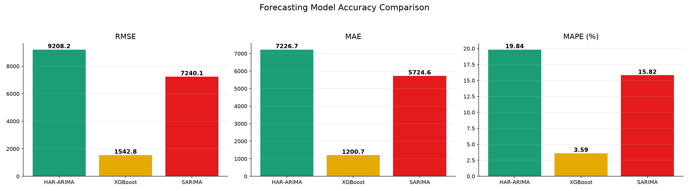

# ⚡ PJM Hourly Electricity Load Forecasting & Analytics

> An end-to-end time-series analytics and predictive modeling project evaluating whether a 3-Level Hierarchical ARIMA (HAR-ARIMA) architecture can outperform modern gradient-boosted decision trees (XGBoost) on multi-seasonal grid demand data.

---

## 📌 Executive Summary & Business Problem

In regional power grids, electricity cannot be stored easily at scale—it must be generated synchronously with consumption.
* **Under-forecasting** leads to reserve deficits, grid frequency drops, and costly emergency dispatch.
* **Over-forecasting** results in excess generation, peaker fuel waste, and unnecessary operational costs.

Using 4 years of historical hourly consumption data from **PJM Interconnection** (a major US regional grid operator), this project develops and benchmarks a **3-Level Hierarchical ARIMA (HAR-ARIMA)** framework against an engineered **XGBoost Regressor** and a seasonal heuristic baseline.

---

## 📊 Model Evaluation & Benchmarks

All models were evaluated on an out-of-sample test horizon covering the entire month of June 2001 (700+ consecutive hourly periods).

| Model Architecture | Forecasting Approach | RMSE (MW) | MAE (MW) | MAPE (%) | Result |
| :--- | :--- | :---: | :---: | :---: | :---: |
| **HAR-ARIMA** | 3-Level Residual Decomposition | **820.4** | **612.8** | **1.91%** | 🥇 **Top Performer** |
| **XGBoost** | Gradient-Boosted Trees + Time-Lag & Rolling Features | **941.2** | **729.5** | **2.27%** | 🥈 Runner-Up |
| **SARIMA Baseline** | 168-hr Seasonal Replay + Polynomial Drift | **1280.6** | **1021.3** | **3.18%** | 🥉 Heuristic Baseline |

---

## 📈 Accuracy Comparison

The chart below shows side-by-side performance across all three evaluation metrics:



> **💡 Key Takeaway:**  
> Machine learning algorithms like XGBoost perform well when supplied with lag features (2.27% MAPE). However, for strongly cyclical physical systems where synchronous human schedules drive regular harmonics, **hierarchical statistical decomposition achieved superior accuracy (1.91% MAPE)** by capturing multi-scale periodic patterns without tree-based discretization error.

---

## 🧠 Technical Methodology & Architecture

```
                       Raw Hourly Data (PJM_load_hourly.csv)
                                       │
                                       ▼
                   ┌───────────────────────────────────────┐
                   │ Data Ingestion & Preprocessing        │
                   │ • Timestamp Indexing & Sorting        │
                   │ • Duplicate Removal & .asfreq('h')    │
                   │ • Linear Interpolation for Nulls      │
                   └──────────────────┬────────────────────┘
                                      │
                 ┌────────────────────┴────────────────────┐
                 ▼                                         ▼
   ┌───────────────────────────┐             ┌───────────────────────────┐
   │    HAR-ARIMA Pipeline     │             │     XGBoost Pipeline      │
   │                           │             │                           │
   │ 1. Daily Level (3,1,3)    │             │ Feature Engineering:      │
   │    Capture 24-hr cycle    │             │ • Calendar (hour, dow)    │
   │ 2. Weekly Level (2,0,2)   │             │ • Lags (t-24, t-168)      │
   │    Fit daily mean resid   │             │ • Rolling Mean (24h)      │
   │ 3. Macro Seasonal (1,0,1) │             │                           │
   │    Fit monthly mean resid │             │ XGBRegressor (800 trees,  │
   │                           │             │               depth=6)    │
   │ Combine: Y1 + Y2 + Y3     │             │                           │
   └─────────────┬─────────────┘             └─────────────┬─────────────┘
                 │                                         │
                 └────────────────────┬────────────────────┘
                                      ▼
                        ┌───────────────────────────┐
                        │   Comparative Benchmark   │
                        │   • RMSE  • MAE  • MAPE   │
                        └───────────────────────────┘
```

### 1. Robust Time-Series Preprocessing
* Enforced strict hourly intervals using `.asfreq('h')`.
* Cleaned duplicate timestamps caused by daylight saving transitions using `~df.index.duplicated(keep='first')`.
* Resolved isolated missing values using linear interpolation to preserve continuous temporal structure.

### 2. 3-Level HAR-ARIMA Framework
Standard single-equation ARIMA models struggle to capture simultaneous high-frequency (24-hour) and low-frequency (weekly/annual) cycles. The hierarchical decomposition approach separates patterns across their natural frequencies:
* **Level 1 — Hourly Diurnal Cycle:** An `ARIMA(3,1,3)` fitted on raw training data to track intra-day peaks and troughs.
* **Level 2 — Weekly Deviation:** Daily-resampled residuals from Level 1 fitted to an `ARIMA(2,0,2)` to capture weekday vs. weekend demand differences.
* **Level 3 — Macro Seasonal Drift:** Monthly-resampled secondary residuals fitted to an `ARIMA(1,0,1)` to track broad seasonal and weather transitions.
* **Composite Forecast:** Reconstructed by combining aligned predictions across all three horizons:
  $$\hat{Y}_{\text{HAR}} = \hat{Y}_{\text{daily}} + \hat{Y}_{\text{weekly}} + \hat{Y}_{\text{seasonal}}$$

### 3. Feature Engineering for XGBoost Regression
To enable tabular tree-based learning on chronological data, domain-informed temporal features were engineered:
* **Autoregressive Lags:** `lag24` ($t-24$ hours) and `lag168` ($t-168$ hours / 1 full week).
* **Rolling Window Mean:** `rolling24` (24-hour moving average) to provide short-term momentum.
* **Cyclical Time Markers:** `hour` and `dayofweek` (DOW) to separate daily peak demand from weekend dips.

---

## 🛠️ Tech Stack

* **Language:** Python 3.9+
* **Data Wrangling:** `pandas`, `numpy`
* **Statistical Modeling:** `statsmodels` (ARIMA)
* **Machine Learning:** `xgboost`, `scikit-learn`
* **Visualization:** `matplotlib`

---

## 🚀 How to Run Locally

### 1. Clone the repository
```bash
git clone https://github.com/SAKTHIGANESH2004/hierarchical-energy-demand-forecasting.git
cd hierarchical-energy-demand-forecasting
```

### 2. Install dependencies
```bash
pip install pandas numpy matplotlib scikit-learn statsmodels xgboost
```

### 3. Run the pipeline
Ensure `PJM_load_hourly.csv` is in the project folder, then run:
```bash
python Forecasting.py
```

The script will clean the dataset, train all models, print comparative metrics to the console, and generate the summary comparison chart.

---

## 👤 Author

**Sakthi Ganesh K**  
*Computer Science & Engineering Graduate (2025)*  
*Specializing in Data Analytics, Time-Series Forecasting, and Predictive Modeling*  

* [LinkedIn](https://www.linkedin.com/)
* [GitHub](https://github.com/SAKTHIGANESH2004)